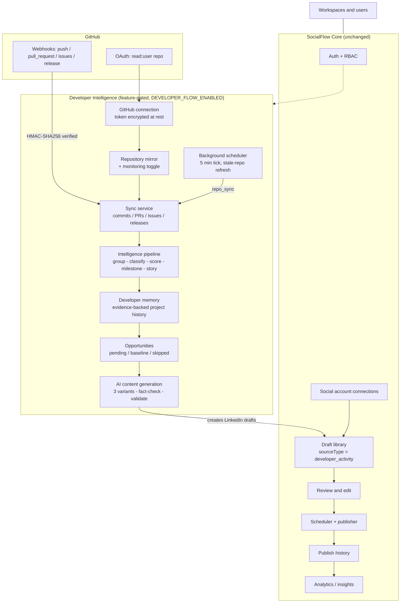

# SocialFlow Architecture

SocialFlow is a social content management platform: users connect social accounts, draft content, review it, schedule it, publish it, and read the resulting analytics. **Developer Intelligence** is a bounded feature inside SocialFlow, not a second platform. It watches a user's GitHub repositories, turns real development work into evidence-backed content opportunities, and generates AI drafts that land in SocialFlow's own draft library. Everything after draft creation (review, scheduling, publishing, history, analytics) stays owned by SocialFlow. The feature is off by default and, when off, is indistinguishable from an unmounted router.

---

## 1. Integrated architecture



Boundary rule: Developer Intelligence produces **drafts**. It never publishes, never schedules, and never reads publish results. Its output enters SocialFlow through exactly one seam, `sourceType: 'developer_activity'` on the draft document.

### Entry points into the sync chain

| Trigger | Source recorded | Route / job |
|---|---|---|
| User clicks Sync now | `manual` | `POST /api/developer/repositories/:id/sync` |
| GitHub delivery | `webhook` | `POST /api/webhooks/github` (flag-gated) |
| Stale repository tick | `scheduled` | `developer.scheduler.ts` (flag-gated) |
| User clicks "mirror repositories" | n/a | `POST /api/developer/repositories/sync` (mirrors rows only, no sync) |

All three real triggers funnel through the single function `syncAndProcess` in `server/src/features/developer/jobs/syncOrchestrator.ts`, so the chain cannot drift between entry points. The `POST /:id/pipeline` route is the one exception: it runs stages 2 to 4 only, so the user can re-derive intelligence without re-hitting the GitHub API.

---

## 2. Ownership

| Responsibility | Owning system |
|---|---|
| Workspaces, users, auth, RBAC | SocialFlow |
| Social account connections (X, LinkedIn, Meta, YouTube, Threads) | SocialFlow |
| Normal (non-developer) content creation | SocialFlow |
| Draft persistence, draft library, draft editing | SocialFlow (fed by the developer feature via `sourceType: 'developer_activity'`) |
| Review and approval | SocialFlow |
| Scheduling and queueing | SocialFlow |
| Publishing | SocialFlow |
| Publish history and retries | SocialFlow |
| Analytics and insights | SocialFlow |
| GitHub connection and token custody | Developer Intelligence |
| Repository mirroring and monitoring toggle | Developer Intelligence |
| Repo sync (commits, PRs, issues, releases, commit files) | Developer Intelligence |
| Activity detection (grouping, classification, diff analysis) | Developer Intelligence |
| Importance scoring and milestone detection | Developer Intelligence |
| Story building (evidence assembly) | Developer Intelligence |
| Developer memory (project history) | Developer Intelligence |
| Opportunity detection and queueing | Developer Intelligence |
| AI content generation (prompts, variants, fact-check, style) | Developer Intelligence |
| Opportunity skip decisions (covered topics, frequency cap) | Developer Intelligence, reading published SocialFlow drafts |

---

## 3. Pipeline flow

```
webhook | manual | scheduled
        |
        v
syncAndProcess(userId, repositoryId, eventType, source)
        |
        |  stage 1  SyncService.runSync
        |           ownership check -> sync log (running) -> GitHub API ->
        |           upsert commits/PRs/issues/releases -> sync log (completed)
        |           lastSyncedAt advances only on a full sync
        |
        |  stage 2  PipelineService.runPipelineForRepository
        |           2a  ActivityService.runIntelligenceForRepository
        |               commits+PRs+issues+releases -> grouped activities ->
        |               diff categorization -> importance score -> milestone ->
        |               evidence-backed story -> persisted activity
        |               (only NEW activity ids continue)
        |           2b  MemoryService.updateMemoryFromActivities
        |               features, milestones, problems solved, project history
        |           2c  OpportunityService.detectAndStore
        |               storage gate: LinkedIn-worthy OR milestone OR HIGH
        |
        |  stage 3  ContentService.runAutoGeneration
        |           settings gates -> pending opportunities -> skip checks ->
        |           story context + style -> AI per variant -> fact-check ->
        |           validate -> persist valid variants as SocialFlow drafts
        |
        v
   SyncProcessResult { isInitialSync, counts, pipeline, generation, errors }
```

### Baseline protection

A repository that has never synced has a **backlog, not news**. `isInitialSync` is captured before any write in `SyncService.runSync`, forwarded to the pipeline as `baseline: true`, and every opportunity detected during that run is stored with status `baseline` instead of `pending`. Baseline opportunities are analysed and visible, but they are never picked up by automatic generation, so connecting a mature repository cannot flood the draft library. A user can promote one manually via the status route (the user-settable statuses are `pending`, `generated`, `skipped`, `rejected`; `baseline` is set by the pipeline alone).

The scheduler reinforces this from the other side: candidates are filtered on `lastSyncedAt != null`, because the first sync is a user action.

### Idempotency and dedup keys

| Data | Dedup key (unique index) | Set by |
|---|---|---|
| Commits | `(repositoryId, sha)` | `syncCommits`, read-before-write plus duplicate-key backstop |
| Commit files | none; inserted once per newly created commit | `syncCommits` |
| Pull requests | `(repositoryId, githubId)` | `syncPullRequests`, upsert |
| Issues | `(repositoryId, githubId)` | `syncIssues`, upsert (PRs filtered out of the issues endpoint) |
| Releases | `(repositoryId, githubId)` | `syncReleases`, upsert |
| Activities | `(repositoryId, evidenceKey)` where `evidenceKey = JSON.stringify(sorted commitShas)` | `ActivityService`, so a re-run over the same commits creates nothing |
| Memory | `(repositoryId, key)`, key slugified from type + title | `MemoryService.upsertMemory`, updates in place and records history |
| Opportunities | `(repositoryId, sourceId)` where `sourceId` is the activity id | `OpportunityService.detectAndStore` |
| Repositories | `(userId, githubId)` | `RepositoryService.mirrorFromGitHub` |
| Connections | `(userId, provider)` | `ConnectionRepository.upsert` |
| Settings | `userId` unique | one settings row per user |

Two cursors keep incremental sync honest: `lastCommitSyncedAt` is the `since` parameter for the commits endpoint, and it advances only after the loop finishes, so an interrupted run re-fetches rather than skipping. `lastSyncedAt` advances only after every data sync in a full sync succeeded.

---

## 4. Feature flag

`DEVELOPER_FLOW_ENABLED` (`server/src/shared/config/env.config.ts`) defaults to `false` and is enabled **only** by the exact string `true`. Any other value keeps the feature off. There is no runtime reload path: a restart is required.

### When off (the default)

| Surface | Behaviour |
|---|---|
| `POST /api/webhooks/github` | Not mounted at all, including its raw-body parser. The path 404s like anything else. |
| Developer scheduler | `startDeveloperScheduler()` is not called at boot; `runDeveloperSchedulerTick` also returns early on the flag as defence in depth. |
| `GET /api/developer/status` | Still 200, returns `{ enabled: false }`. Unauthenticated and ungated: the client needs it to decide whether to render anything. |
| Every other `/api/developer/*` route | 404 via `developerFlowGate`, indistinguishable from an unmounted router. |
| Sidebar "Developer" entry | Hidden. `Sidebar.tsx` calls `/developer/status` on login and adds the item only when `enabled === true`; a failed request is treated as disabled. |
| SocialFlow itself | Unchanged. `POST /api/drafts` and every other route keep working with the flag off. |

### When on

`/api/developer/*` becomes live, the GitHub webhook route and its raw-body capture are mounted, the background scheduler starts (first tick after 60s, then every 5 minutes), and the sidebar entry appears. All routes except `/status` require authentication; every request is scoped to the caller's own `userId`, and repository-level reads verify ownership before the id reaches a query.

### Related environment variables

| Variable | Required | Purpose |
|---|---|---|
| `GITHUB_CLIENT_ID` | Yes, for OAuth | GitHub OAuth app id |
| `GITHUB_CLIENT_SECRET` | Yes, for OAuth | GitHub OAuth app secret; exchanged for the access token |
| `GITHUB_WEBHOOK_SECRET` | Yes, for webhooks | HMAC-SHA256 secret for `x-hub-signature-256`. Without it, the webhook route returns a provider-not-configured error. |

All three are optional in the schema: with the feature off no GitHub credentials are needed. The OAuth scope is `read:user repo`. The access token is encrypted at rest with `ENCRYPTION_KEY` and is stripped from the connection model's `toJSON`, so it never leaves the server through any endpoint.

---

## 5. Error isolation

The design goal is that no developer-feature failure can degrade SocialFlow. Isolation is deliberately asymmetric.

| Layer | On failure | Evidence |
|---|---|---|
| Stage 1 (sync) inside `syncAndProcess` | **Throws.** Nothing was imported, so the caller must see it. No derived rows are written. | `syncOrchestrator.ts`, asserted in `error-isolation.test.ts` |
| Sync log | `status: 'failed'`, `errorMessage` truncated to 500 chars, `completedAt` set. | `SyncService.markFailed` |
| Repository row | `syncStatus: 'error'`. Best-effort: a DB failure here is logged and does not mask the original error. | `SyncService.markFailed` |
| Stage 2 (intelligence, memory, opportunities) | Swallowed and pushed into `SyncProcessResult.errors` as `pipeline: <message>`, and logged. The sync data is already committed and every stage is idempotent, so the next trigger re-processes what was missed. | `syncOrchestrator.ts` |
| Stage 3 (auto-generation) | Swallowed into `errors` as `generation: <message>`. `runAutoGeneration` also catches its own failures internally and returns an empty result. | `syncOrchestrator.ts`, `content.service.ts` |
| Per opportunity inside the auto loop | Caught, counted as `skipped`, the loop continues. The opportunity status is not flipped, so a later run can retry. | `content.service.ts` |
| Per AI variant | Caught, recorded in `failedVariants`, siblings still persist. If every variant fails, the opportunity stays `pending` and a retry can succeed. | `ContentService.generateVariants` |
| Scheduler batch | Each repository is claimed then synced in its own `try/catch`; one bad repository cannot stop the batch, and `runDeveloperSchedulerTick` never throws out of the interval. | `developer.scheduler.ts` |
| Webhook delivery | The route answers **202** for every acknowledged delivery, even when the dispatched sync subsequently fails, because GitHub disables a webhook that does not get a 2xx. The per-repository chains are fire-and-forget with their errors logged. | `github.webhook.routes.ts`, `github.webhook.ts` |
| Webhook signature | Rejected before any work: missing or invalid HMAC, missing event header. Length is compared before `timingSafeEqual` so a malformed header is a clean 401, not a 500. | `github.webhook.ts` |
| Overview counters | Each collection is counted independently and degrades to 0 on error, so one collection problem cannot blank the dashboard. | `DeveloperService.getOverview` |
| Draft route coexistence | A failed developer chain writes no drafts, and plain SocialFlow drafts are byte-identical to before the feature existed (all developer fields are optional and undefaulted). | `draft.model.ts`, `developer.flag.test.ts` |

Two content gates also protect the draft queue rather than the process. `validatePost` drops degenerate variants (model misfires, reasoning leaks) before they are persisted, and `factCheckPost` compares the generated text against the activity evidence to block invented metrics and unproven claims. If every variant fails validation, nothing is persisted and the opportunity is not marked `generated`.

---

## 6. Data model

Fourteen collections, all namespaced `developer_*`, all scoped by `userId`. Thirteen are Mongoose models; the count includes the memory history collection that backs the memory edit audit trail.

| Collection | Purpose |
|---|---|
| `developer_connections` | One GitHub connection per user per provider; encrypted access token, profile metadata. Token fields are stripped on serialization. |
| `developer_repositories` | Local mirror of a GitHub repository plus monitoring flag, sync status, and the three sync cursors. |
| `developer_commits` | Commit metadata with additions, deletions, files changed, verification state, and timestamps. |
| `developer_commit_files` | Per-commit file-level diff rows; the input to diff categorization and module detection. |
| `developer_pull_requests` | PR state, labels, diff totals, merge info, and branch names. |
| `developer_issues` | Issue state, labels, assignees, milestone. PRs returned by the GitHub issues endpoint are filtered out here. |
| `developer_releases` | Tags, draft and prerelease flags, asset counts, publish dates. |
| `developer_activities` | Grouped, classified, scored units of work with `evidence`, `evidenceKey`, confidence, and links back to commit, PR, and issue ids. |
| `developer_memory` | Persistent project knowledge by category (`feature`, `problem_solved`, `milestone`, `architecture`, `tech_stack`, `history`, ...) with provenance and `active`/`archived` status. |
| `developer_memory_history` | Append-only audit trail of memory create, update, archive, and restore, including user edits. |
| `developer_opportunities` | Content opportunities queued from worthy activities, with `pending`/`baseline`/`generated`/`skipped`/`rejected` status, importance, and evidence metadata. |
| `developer_settings` | Per-user automation and AI preferences: opportunity detection, draft generation, auto content, auto publish, tone, frequency window, caps, custom instructions. |
| `developer_sync_logs` | One row per sync attempt with source, event type, status, record counts, error message, and timings. |

The one non-`developer_*` write is the SocialFlow draft: `content.service.ts` calls `DraftService.createDraft` with `sourceType: 'developer_activity'` and attaches `developerActivityId`, `developerRepositoryId`, `developerOpportunityId`, `evidence`, and `aiMetadata` (`variant`, `factCheck`, `validation`, `style`, `opportunityTitle`). Every one of those fields is optional and undefaulted, so documents created through the plain draft API are unaffected.

---

## 7. Documented deviations and deliberate limitations

1. **`autoPublish` gates generation, never publishing.** The setting is read as one of the three switches that enable the auto-generation pass, but nothing in the content service publishes. There is no approved or auto-publish path for developer drafts, and publishing must stay SocialFlow-owned. Marked in code as a `ponytail` note in `content.service.ts`; the upgrade path is to queue through `DraftPublisher.queueForPublishing` once the product wants developer drafts to auto-queue. A user enabling `autoPublish` therefore gets generated drafts awaiting review, not posts on their timeline.

2. **The GitHub OAuth callback is SPA-based.** The authorize URL is built without a `redirect_uri`, so GitHub returns to whichever callback URL is registered on the OAuth app. That URL must be set to the app's `/developer/github/callback` route (`client/src/App.tsx`), which reads `code` and `state` from the query string, posts them to `POST /api/developer/github/callback`, then `postMessage`es the opener and closes itself. If the registered callback does not match that route, the handshake silently returns the user to the wrong page.

3. **Covered topics are read from published developer drafts.** SocialFlow's `posts` collection has no metadata field, so the duplicate-topic check reads `aiMetadata.opportunityTitle` from the user's **published** `sourceType: 'developer_activity'` drafts through the existing draft repository, with no schema bypass. A topic covered by a draft that is still in review is not counted as covered.

4. **The frequency cap is a target, never a quota.** `schedMinPosts` is stored and surfaced but generation is only ever gated by `schedMaxPosts`. Generation still requires a pending, evidence-backed opportunity, so the cap can never force fabricated content to hit a number.

5. **The repository description is deliberately not fed to the model.** It is user meta-commentary rather than verified evidence and would leak into posts as false claims about the work, so `buildStoryContext` is given `projectDescription: undefined`.

6. **Swagger does not document the developer API.** `server/src/docs/swagger.json` (served at `/api-docs`) contains no `/api/developer` paths, so the feature's contract lives in this document and in the route file rather than in the generated spec.

7. **No runtime flag reload.** `env.developerFlowEnabled` is read live by the gate and by `getStatus`, which is what makes the flag testable in-process, but the env itself is only parsed at boot. Turning the feature on or off requires a restart.

---

## 8. Testing

The full backend suite is **179 tests across 19 suites**: 87 pre-existing SocialFlow tests and 92 Developer Intelligence tests.

| Developer suite | Tests | Covers |
|---|---|---|
| `developer.permissions.test.ts` | 18 | Auth required, cross-user access denied on every resource |
| `developer.flag.test.ts` | 17 | Flag off 404s every route, webhook route absent, `/status` still public, drafts unaffected |
| `content.gates.test.ts` | 17 | Opportunity gate, fact-check and validation gates, auto-generation rules |
| `settings.test.ts` | 17 | Defaults, whitelisted partial updates, invalid values rejected |
| `error-isolation.test.ts` | 13 | Stage 1 throws and records failure, stages 2 and 3 are swallowed, webhook answers 202 anyway |
| `intelligence.test.ts` | 6 | Grouping, categorization, importance scoring, milestone detection |
| `sync-idempotency.test.ts` | 4 | Re-running a sync creates no duplicates at any key |

Run everything from the repo root:

```bash
npm test
```

which delegates to `cd server && jest --runInBand` (or `npm test` inside `server/` directly). Tests use `mongodb-memory-server`, so no live database is touched, and `jest.env.setup.js` never sets `DEVELOPER_FLOW_ENABLED`, so the default-off path is what the suite exercises unless a test opts in explicitly.

---

## 9. Related documents

| Document | Contents |
|---|---|
| `none.md` | Runtime verification report for SocialFlow AI: environment variable proof, database state, encryption, scheduler, platform status matrix. |
| `client/README.md` | Stock Vite + React template notes for the client workspace. |
| `/api-docs` | Swagger UI for the SocialFlow API. Does not yet include the developer routes. |
