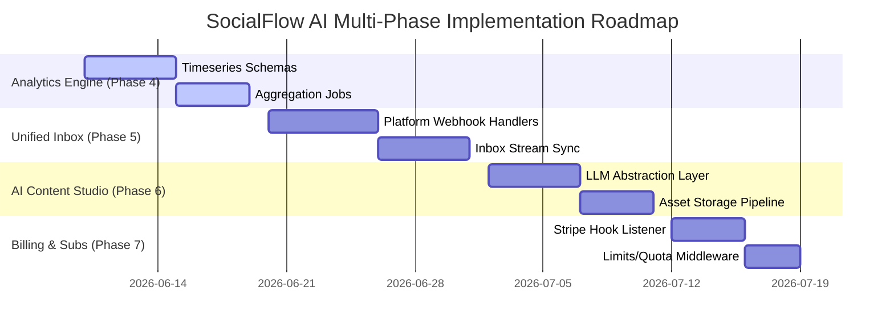

# Principal Architecture Review: SocialFlow AI

**Prepared by**: Principal Software Architect  
**Review Scope**: Phases 1–3 (Auth, Workspace/RBAC, Social OAuth Abstraction, Post Scheduling Queue)  
**System Status**: Pre-Production Audit  

---

## 1. Architecture Scorecard

The system utilizes a clean, feature-based architecture (Service → Repository → Model), separating concerns well. However, critical gaps in multi-tenancy isolation and database query performance limit its current production readiness.

```mermaid
radar-chart
    title "Architecture Scorecard (1-10 Scale)"
    "Multi-Tenancy & Isolation" : 4
    "Reliability & Queueing" : 8
    "Data Access & Performance" : 5
    "Security & Cryptography" : 7
    "Clean Code & Patterns" : 8
```

* **Multi-Tenancy & Isolation (4/10)**: High risk. While Workspace and RBAC features exist, the core publishing assets (Posts, Social Accounts) are bound directly to `userId`, creating a tenant-isolation disconnect.
* **Reliability & Queueing (8/10)**: Strong. The BullMQ scheduler + resilient database interval fallback is well-designed. Needs worker concurrency tuning.
* **Data Access & Performance (5/10)**: Moderate risk. System contains several N+1 query patterns in workspace rosters and lacks database indices on critical foreign keys.
* **Security & Cryptography (7/10)**: Moderate. AES-256-CBC is utilized for OAuth credentials, but lacks authenticity verification (GCM mode).
* **Clean Code & Patterns (8/10)**: Excellent. Validation (Zod), AppError handlers, and repository patterns are strictly followed.

---

## 2. Security Audit Report

### Issue S1: Unauthenticated Symmetrical Encryption (AES-256-CBC)
* **Severity**: **High**
* **Impact**: Decryption in CBC mode does not verify ciphertext integrity (lacks an AEAD tag). An attacker with database write access could modify stored tokens, leading to padding oracle attacks or silent decryption corruption.
* **Recommended Fix**: Upgrade the encryption adapter to use authenticated **AES-256-GCM** with a 16-byte authentication tag.
* **Refactor Example**:
  ```typescript
  // src/services/social/adapters/encryption.adapter.ts
  const ALGORITHM = 'aes-256-gcm';
  const IV_LENGTH = 12; // GCM standard IV length
  const TAG_LENGTH = 16;

  export class EncryptionAdapter {
    static encrypt(text: string): string {
      const iv = crypto.randomBytes(IV_LENGTH);
      const cipher = crypto.createCipheriv(ALGORITHM, ENCRYPTION_KEY, iv);
      let encrypted = cipher.update(text, 'utf8', 'hex');
      encrypted += cipher.final('hex');
      const tag = cipher.getAuthTag();
      return `${iv.toString('hex')}:${tag.toString('hex')}:${encrypted}`;
    }

    static decrypt(encryptedText: string): string {
      const [ivHex, tagHex, cryptoHex] = encryptedText.split(':');
      if (!ivHex || !tagHex || !cryptoHex) throw new Error('Invalid GCM format');
      const decipher = crypto.createDecipheriv(ALGORITHM, ENCRYPTION_KEY, Buffer.from(ivHex, 'hex'));
      decipher.setAuthTag(Buffer.from(tagHex, 'hex'));
      let decrypted = decipher.update(Buffer.from(cryptoHex, 'hex'), undefined, 'utf8');
      decrypted += decipher.final('utf8');
      return decrypted;
    }
  }
  ```

### Issue S2: Symmetric JWT Secret Sharing
* **Severity**: **Medium**
* **Impact**: If the `JWT_SECRET` is compromised, attackers can forge admin or user tokens.
* **Recommended Fix**: Shift from symmetric HMAC (HS256) to asymmetric RSA (RS256) or ECDSA key pairs. The backend signs tokens with a private key, and verifies them using a public key.

---

## 3. Database Audit

### Issue D1: Missing Index Definitions on Query Conditions
* **Severity**: **Critical**
* **Impact**: Highly frequent queries (e.g. searching accounts by platform/userId, scanning scheduled posts) perform collection scans. As collections grow, DB CPU will spike, leading to query timeouts.
* **Recommended Fix**: Define compound and sparse indexes on lookup keys.
* **Refactor Example**:
  ```typescript
  // src/features/post/post.model.ts
  // Index for post list filters and scheduled-queue scanning
  PostSchema.index({ userId: 1, status: 1 });
  PostSchema.index({ status: 1, scheduledAt: 1 }, { sparse: true });

  // src/database/db.ts - SocialAccountSchema
  SocialAccountSchema.index({ userId: 1, platform: 1, accountId: 1 }, { unique: true });
  ```

### Issue D2: Post Schema Multi-Tenant Disconnection
* **Severity**: **Critical**
* **Impact**: Posts are isolated by `userId`. An editor in a workspace cannot edit or view drafts/scheduled posts created by another user in the same workspace.
* **Recommended Fix**: Add a required `workspaceId: string` field to the `Post` model and validate workspace membership inside the post route handlers.
* **Refactor Example**:
  ```typescript
  // src/features/post/post.model.ts
  export interface IPost extends Document {
    workspaceId: string; // Enforce multi-tenancy scope
    userId: string; // The creator ID
    // ...
  }
  ```

---

## 4. Performance Audit

### Issue P1: N+1 Query Loop in Workspace Roster & Member Enrichment
* **Severity**: **High**
* **Impact**: Fetching workspace members queries the User collection sequentially in a loop for each member, resulting in $N+1$ database roundtrips.
* **Recommended Fix**: Bulk-fetch users using `$in` query or Mongoose `.populate()` references.
* **Refactor Example**:
  ```typescript
  // src/features/workspace/workspace.service.ts
  async listMembers(workspaceId: string, callerId: string) {
    const callerMember = await this.workspaceRepository.findMember(workspaceId, callerId);
    if (!callerMember) throw AppError.forbidden('Unauthorized access');

    const members = await this.workspaceRepository.listMembers(workspaceId);
    const userIds = members.map(m => m.userId);

    // Single DB query to fetch all user profiles
    const users = await this.userRepository.findManyByIds(userIds);
    const userMap = new Map(users.map(u => [u._id.toString(), u]));

    return members.map(member => {
      const user = userMap.get(member.userId);
      return {
        userId: member.userId,
        fullName: user?.fullName || 'Unknown User',
        email: user?.email || '',
        role: member.role,
        joinedAt: member.createdAt.toISOString()
      };
    });
  }
  ```

### Issue P2: BullMQ Worker Single Concurrency Limit
* **Severity**: **Medium**
* **Impact**: By default, BullMQ Workers run with a concurrency of `1`. If 50 posts are scheduled at 9:00 AM, they publish sequentially. If one platform API response slows down, subsequent posts will experience significant publishing lag.
* **Recommended Fix**: Explicitly define worker concurrency options based on system resources (e.g. `concurrency: 10`).
* **Refactor Example**:
  ```typescript
  // src/services/queue/post.worker.ts
  const worker = new Worker(
    'post-publishing',
    async (job: Job) => { ... },
    { connection: connection as any, concurrency: 10 }
  );
  ```

---

## 5. Technical Debt List

1. **Transient vs. Permanent Queue Failure Handling**: The `post.worker.ts` retries all errors (e.g. transient socket timeouts vs. permanent "OAuth Token Expired" errors). Permanent errors should fail immediately to avoid resource wastage.
2. **Platform Enum Duplication**: The list of platforms is declared statically in Zod validator schemas, Mongoose string arrays, and provider strategies. Should be consolidated into a unified Platform enum/type.
3. **Database Seed Transactions**: Linkage simulation triggers multiple writes across collections (`AnalyticsMetric`, `Comment`) without transaction boundaries. Failure midway results in orphaned data records.

---

## 6. Future Roadmap (Phases 4–7)



### Phase 4: Analytics Engine (Timeseries & Metrics aggregation)
* **Goal**: Provide visual statistics dashboards for follower growth, reach, impressions, and click-through rates.
* **Schema Blueprint**:
  * Implement MongoDB Timeseries collections for raw events (e.g. `platform_events` containing hourly snapshot changes).
  * Weekly/Monthly aggregation pipelines to pre-compute historical statistics, preventing high-latency dashboard loads.

### Phase 5: Unified Inbox (Syncing reviews, comments & messages)
* **Goal**: Enable community managers to read and reply to comments from LinkedIn, YouTube, and X in one console.
* **Architectural Flow**:
  1. Register Webhook endpoints (`/api/webhooks/social/:platform`) to receive inbound user interactions.
  2. Implement an asynchronous Sync Queue (BullMQ) to parse incoming comments, map them to posts, and ingest them into the `Comment` model.
  3. Support SSE (Server-Sent Events) or WebSockets to stream inbox items to the client dashboard in real-time.

### Phase 6: AI Content Studio (Content Generation & Suggestions)
* **Goal**: AI assistant that generates optimized copy, suggests hashtags, and resizes image formats for individual social channels.
* **Architecture**:
  * Standardize LLM providers through a common interface (supporting OpenRouter, Claude, or OpenAI).
  * Build a prompt-compiler that injects platform-specific style sheets (e.g., short/hooky for X, formal/professional for LinkedIn).
  * Implement object storage integration (S3/Cloud Storage) to store, crop, and deliver generated media assets.

### Phase 7: Billing & Subscriptions (Stripe Integration)
* **Goal**: Tiered subscription plans (Free, Pro, Agency) governing workspace capacity, linked social accounts, and monthly AI generation tokens.
* **Architecture**:
  * Stripe Webhook listener (`POST /api/billing/webhook`) managing subscription life cycles (active, delinquent, cancelled).
  * Custom Express middleware (`checkLimits`) placed at workspace, connection, and post routes to enforce plan limits on the database before executing business operations.
