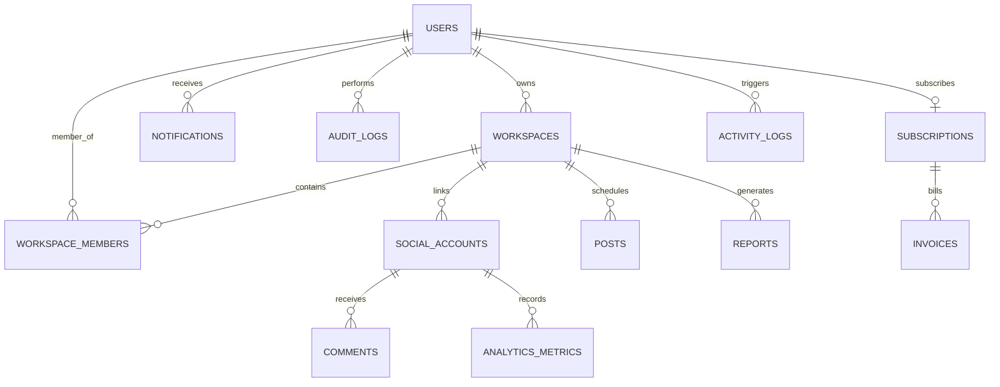

# Database Architecture Review & Scaling Plan

This review details the database design for **SocialFlow AI**, addressing scaling requirements to support **100,000 users**, **1,000,000 scheduled posts**, and **10,000,000 analytics records** on **MongoDB Atlas**.

---

## 1. Entity-Relationship (ER) Diagram

The diagram below maps the references and relationships between the 5 existing collections and the 8 recommended collections.



---

## 2. Collections Architecture Review

### Collection 1: `users`
* **Role**: Primary user credentials, profiles, and registration metadata.
* **Schema**:
  ```json
  {
    "_id": "ObjectId",
    "email": "String (unique, lowercase, trim)",
    "passwordHash": "String (bcrypt)",
    "fullName": "String",
    "avatarUrl": "String (optional)",
    "createdAt": "Date",
    "updatedAt": "Date"
  }
  ```
* **Indexes**:
  * `email`: `1` (Unique, ascending)
* **Relationships**:
  * `1:N` with `workspaces` (via `ownerId` reference).
  * `1:N` with `workspace_members` (via `userId` reference).
* **Query Patterns**:
  * Authenticate: `db.users.findOne({ email: "user@domain.com" })`
  * Fetch profile: `db.users.findById(userId)`
* **Estimated Scale (100,000 users)**:
  * Avg Doc Size: `400 bytes` | Total Data: `~40 MB`
  * Index Size: `~3.2 MB` (fully resident in RAM).

---

### Collection 2: `workspaces`
* **Role**: Organizational boundaries enabling team collaborations and asset grouping.
* **Schema**:
  ```json
  {
    "_id": "ObjectId",
    "name": "String",
    "ownerId": "ObjectId (ref: users)",
    "settings": {
      "timezone": "String",
      "allowedPlatforms": ["String"]
    },
    "createdAt": "Date",
    "updatedAt": "Date"
  }
  ```
* **Indexes**:
  * `ownerId`: `1` (Allows querying workspaces owned by a user)
* **Relationships**:
  * `N:1` with `users` (as owners).
  * `1:N` with `posts`, `social_accounts`, and `workspace_members`.
* **Query Patterns**:
  * List workspaces owned: `db.workspaces.find({ ownerId: userId })`
* **Estimated Scale (120,000 workspaces)**:
  * Avg Doc Size: `350 bytes` | Total Data: `~42 MB`
  * Index Size: `~3.1 MB`.

---

### Collection 3: `workspace_members` (Existing)
* **Role**: Maps user membership and access control roles (`owner`, `admin`, `editor`, `viewer`) within specific workspaces.
* **Schema**:
  ```json
  {
    "_id": "ObjectId",
    "workspaceId": "ObjectId (ref: workspaces)",
    "userId": "ObjectId (ref: users)",
    "role": "String (enum: owner, admin, editor, viewer)",
    "createdAt": "Date"
  }
  ```
* **Indexes**:
  * Compound: `{ workspaceId: 1, userId: 1 }` (Unique lookup for access checks)
  * `userId`: `1` (For listing user's memberships)
* **Relationships**:
  * `N:1` with `workspaces`
  * `N:1` with `users`
* **Query Patterns**:
  * Check membership & RBAC: `db.workspace_members.findOne({ workspaceId: workspaceId, userId: userId })`
  * List workspace roster: `db.workspace_members.find({ workspaceId: workspaceId })`
  * List workspaces for user: `db.workspace_members.find({ userId: userId })`
* **Estimated Scale (130,000 membership records)**:
  * Avg Doc Size: `200 bytes` | Total Data: `~26 MB`
  * Index Size: `~5.2 MB`.

---

### Collection 4: `social_accounts`
* **Role**: Connected platform linkages (X, LinkedIn, YouTube) storing encrypted OAuth credentials.
* **Schema**:
  ```json
  {
    "_id": "ObjectId",
    "workspaceId": "ObjectId (ref: workspaces)",
    "userId": "ObjectId (ref: users)",
    "platform": "String (enum: x, linkedin, youtube, etc.)",
    "accountId": "String",
    "username": "String",
    "displayName": "String",
    "avatarUrl": "String",
    "accessToken": "String (encrypted format: iv:tag:ciphertext)",
    "refreshToken": "String (encrypted, optional)",
    "expiresAt": "Date (optional)",
    "metadata": "Mixed",
    "createdAt": "Date"
  }
  ```
* **Indexes**:
  * `workspaceId`: `1`
  * Compound: `{ platform: 1, accountId: 1 }` (Unique lookup)
  * Compound: `{ userId: 1, platform: 1 }`
* **Relationships**:
  * `N:1` with `workspaces` (scoped to teams).
  * `N:1` with `users` (the connection creator).
* **Query Patterns**:
  * Fetch workspace links: `db.social_accounts.find({ workspaceId: workspaceId })`
  * Verify account link: `db.social_accounts.findOne({ platform: "x", accountId: "123" })`
* **Estimated Scale (300,000 accounts - avg. 3 per user)**:
  * Avg Doc Size: `1.5 KB` | Total Data: `~450 MB`
  * Index Size: `~12.8 MB`.

---

### Collection 5: `posts`
* **Role**: Social media publications (draft, scheduled, published, failed).
* **Schema**:
  ```json
  {
    "_id": "ObjectId",
    "workspaceId": "ObjectId (ref: workspaces)",
    "userId": "ObjectId (ref: users)",
    "platforms": ["String"],
    "content": "String",
    "media": ["String"],
    "platformContent": "Map (platform -> platformSpecificPublishedId)",
    "status": "String (enum: draft, scheduled, published, failed)",
    "scheduledAt": "Date (sparse index)",
    "publishedAt": "Date",
    "failedReason": "String",
    "createdAt": "Date",
    "updatedAt": "Date"
  }
  ```
* **Indexes**:
  * Compound: `{ workspaceId: 1, status: 1 }` (Filters active boards)
  * Compound: `{ status: 1, scheduledAt: 1 }` (Queue scanner lookup - sparse index)
* **Relationships**:
  * `N:1` with `workspaces` (Tenant isolation boundary).
  * `N:1` with `users` (Creator identification).
* **Query Patterns**:
  * Queue fetch: `db.posts.find({ status: "scheduled", scheduledAt: { $lte: new Date() } })`
  * Workspace Board: `db.posts.find({ workspaceId: workspaceId }).sort({ createdAt: -1 })`
* **Estimated Scale (1,000,000 posts)**:
  * Avg Doc Size: `2 KB` | Total Data: `~2.0 GB`
  * Index Size: `~88 MB` (Must be pinned in RAM for instant queue execution).

---

### Collection 6: `analytics_metrics` (Recommended - Time Series)
* **Role**: Holds daily statistics snapshots (follower count, click-through rates, impressions) for linked profiles.
* **Schema (MongoDB Time Series Specific)**:
  ```json
  {
    "timestamp": "Date", 
    "metaField": {
      "socialAccountId": "ObjectId (ref: social_accounts)",
      "platform": "String"
    },
    "followers": "Int",
    "reach": "Int",
    "impressions": "Int",
    "clicks": "Int",
    "engagement": "Int"
  }
  ```
* **Indexes**:
  * Managed automatically by MongoDB Time Series engine (automatically creates compound index on `{ metaField: 1, timestamp: -1 }`).
* **Relationships**:
  * `N:1` with `social_accounts` (via `socialAccountId`).
* **Query Patterns**:
  * Multi-day aggregates: `db.analytics_metrics.aggregate([{ $match: { "metaField.socialAccountId": accountId, timestamp: { $gte: startDate } } }])`
* **Estimated Scale (10,000,000 records)**:
  * Avg Doc Size: `120 bytes` (Highly compressed via columnar timeseries compression).
  * Total Data: `~1.2 GB` (Compressed down to `~250 MB` on disk).
  * Index Size: `~18 MB`.

---

### Collection 7: `notifications` (Recommended)
* **Role**: In-app notifications alerting users to workspace updates or post scheduling failures.
* **Schema**:
  ```json
  {
    "_id": "ObjectId",
    "userId": "ObjectId (ref: users)",
    "title": "String",
    "message": "String",
    "type": "String (enum: post_failed, post_published, workspace_invite)",
    "read": "Boolean",
    "createdAt": "Date"
  }
  ```
* **Indexes**:
  * Compound: `{ userId: 1, read: 1 }`
  * `createdAt`: `1` (TTL index: 30 days)
* **Query Patterns**:
  * Fetch unread: `db.notifications.find({ userId: userId, read: false }).sort({ createdAt: -1 })`
* **Estimated Scale**:
  * Average active set: `1,000,000 active documents` (Auto-purged via TTL).
  * Avg Doc Size: `300 bytes` | Total Data: `~300 MB` | Index Size: `~22 MB`.

---

### Collection 8: `activity_logs` (Recommended)
* **Role**: Operational log showing workspace edits, publishing runs, and queue additions for team audibility.
* **Schema**:
  ```json
  {
    "_id": "ObjectId",
    "userId": "ObjectId (ref: users)",
    "workspaceId": "ObjectId (ref: workspaces)",
    "action": "String",
    "details": "String",
    "createdAt": "Date"
  }
  ```
* **Indexes**:
  * `workspaceId`: `1`
  * `createdAt`: `1` (TTL Index: 90 days)
* **Query Patterns**:
  * Fetch team feed: `db.activity_logs.find({ workspaceId: workspaceId }).sort({ createdAt: -1 })`
* **Estimated Scale (5,000,000 logs)**:
  * Avg Doc Size: `250 bytes` | Total Data: `~1.25 GB` | Index Size: `~68 MB`.

---

### Collection 9: `comments` (Recommended)
* **Role**: Syncs inbound reviews/messages from social accounts, facilitating central inbox conversations.
* **Schema**:
  ```json
  {
    "_id": "ObjectId",
    "socialAccountId": "ObjectId (ref: social_accounts)",
    "platform": "String",
    "externalCommentId": "String",
    "postTitle": "String",
    "author": {
      "username": "String",
      "displayName": "String",
      "avatarUrl": "String"
    },
    "message": "String",
    "status": "String (enum: unresolved, resolved)",
    "replies": [
      {
        "authorName": "String",
        "message": "String",
        "isBrandReply": "Boolean",
        "createdAt": "Date"
      }
    ],
    "createdAt": "Date"
  }
  ```
* **Indexes**:
  * Compound: `{ socialAccountId: 1, status: 1 }`
  * `externalCommentId`: `1` (Unique validation)
* **Relationships**:
  * `N:1` with `social_accounts`.
* **Query Patterns**:
  * Fetch Inbox: `db.comments.find({ socialAccountId: accountId, status: "unresolved" }).sort({ createdAt: -1 })`
* **Estimated Scale (5,000,000 records)**:
  * Avg Doc Size: `600 bytes` | Total Data: `~3.0 GB` | Index Size: `~112 MB`.

---

### Collection 10: `reports` (Recommended)
* **Role**: Stores generated periodic PDF/JSON dashboard reports.
* **Schema**:
  ```json
  {
    "_id": "ObjectId",
    "workspaceId": "ObjectId (ref: workspaces)",
    "name": "String",
    "range": {
      "start": "Date",
      "end": "Date"
    },
    "metricsSummary": "Mixed (Aggregated counts)",
    "downloadUrl": "String",
    "createdAt": "Date"
  }
  ```
* **Indexes**:
  * `workspaceId`: `1`
* **Estimated Scale (10,000 reports)**:
  * Avg Doc Size: `1.2 KB` | Total Data: `~12 MB`.

---

### Collection 11: `subscriptions` (Recommended)
* **Role**: Billing tracking containing Stripe subscription status and plan tiers.
* **Schema**:
  ```json
  {
    "_id": "ObjectId",
    "userId": "ObjectId (ref: users)",
    "stripeCustomerId": "String",
    "stripeSubscriptionId": "String",
    "planTier": "String (enum: free, pro, agency)",
    "status": "String (enum: active, past_due, canceled)",
    "currentPeriodEnd": "Date"
  }
  ```
* **Indexes**:
  * `userId`: `1` (Unique)
  * `stripeSubscriptionId`: `1` (Unique)
* **Estimated Scale (100,000 subscriptions)**:
  * Avg Doc Size: `300 bytes` | Total Data: `~30 MB`.

---

### Collection 12: `invoices` (Recommended)
* **Role**: Customer payment history references.
* **Schema**:
  ```json
  {
    "_id": "ObjectId",
    "subscriptionId": "ObjectId (ref: subscriptions)",
    "stripeInvoiceId": "String",
    "amountPaid": "Int (cents)",
    "currency": "String",
    "pdfUrl": "String",
    "status": "String",
    "createdAt": "Date"
  }
  ```
* **Indexes**:
  * `subscriptionId`: `1`
* **Estimated Scale (500,000 invoices)**:
  * Avg Doc Size: `250 bytes` | Total Data: `~125 MB`.

---

### Collection 13: `audit_logs` (Recommended)
* **Role**: Immutable security log recording admin operations, logins, API token generation, and password changes.
* **Schema**:
  ```json
  {
    "_id": "ObjectId",
    "userId": "ObjectId (ref: users)",
    "ipAddress": "String",
    "userAgent": "String",
    "event": "String (enum: login_success, password_change, api_key_created)",
    "severity": "String (enum: low, medium, high)",
    "createdAt": "Date"
  }
  ```
* **Indexes**:
  * Compound: `{ userId: 1, event: 1 }`
  * `createdAt`: `1` (TTL Index: 180 days)
* **Query Patterns**:
  * Compound: `{ userId: 1, event: 1 }`
  * `createdAt`: `1` (TTL Index: 180 days)
* **Estimated Scale (1,000,000 logs)**:
  * Avg Doc Size: `300 bytes` | Total Data: `~300 MB` | Index Size: `~24 MB`.

---

## 3. MongoDB Atlas Specific Optimizations

To scale this database cost-effectively and ensure sub-second response times on Atlas, we recommend the following deployment configurations:

### 1. Storage & Indexes RAM Resident Rule
At the target scale, the total active index sizes for all collections equals **~350 MB**.
* **Recommendation**: Configure an Atlas **M30** tier cluster (provides 8 GB RAM, 2 vCPUs). This guarantees that the entire working index set resides fully in memory, preventing disk paging.

### 2. Time Series Collection for Analytics
* By declaring `analytics_metrics` as a native MongoDB Time Series collection, Atlas uses columnar compression to store data. This yields up to **80% storage savings** and significantly speeds up metrics aggregation pipelines.
* Configure a **Granularity** of `days` for snapshot metrics.

### 3. TTL Auto-Purging
* Avoid manual clean-up scripts that locks database rows.
* Set TTL indexes on `notifications` (30 days), `activity_logs` (90 days), and `audit_logs` (180 days) to automatically prune transient records.

### 4. Read/Write Split & Connection Pooling
* Configure database connections in the Node server using:
  `mongodb+srv://.../socialflow?maxPoolSize=50&w=majority&readPreference=secondaryPreferred`
* Dashboard reads for analytics metrics and history logs should read from secondary replica nodes (`secondaryPreferred`), keeping the primary replica node entirely unburdened to handle write operations (publishing updates and scheduling).
